# 📘 Documentação Técnica – Solução To-Be

## 1. Visão Geral

*   **Contexto:**  
    A solução tem como objetivo gerenciar formulários, tickets e workflows de forma integrada. Atualmente, o sistema permite criar formulários dinâmicos, associá-los a tickets e acompanhar o progresso via workflows configuráveis.
    
*   **Objetivo To-Be:**  
    Evoluir o MVP para um modelo completo de gestão de tickets e workflows, mantendo flexibilidade de criação de formulários, integração com agentes de IA e rastreabilidade de processos, mas sem adicionar complexidade desnecessária nesta fase inicial.
    
*   **Stakeholders:**
    *   Usuários finais: solicitantes de tickets
        
    *   Gestores: aprovadores e responsáveis por workflows
        
    *   Equipe técnica: desenvolvedores backend, frontend e DevOps
        
    *   Agentes de IA: utilizados para sugestões ou automações dentro do fluxo
        
## 2. Arquitetura da Solução

*   **Visão de alto nível:**
    
    `Frontend (React + ReactFlow) → API (FastAPI/Python) → Backend (CRUD Services) → Banco de Dados (PostgreSQL)`
    
*   **Tecnologias utilizadas:**
    *   Frontend: React, TailwindCSS, ReactFlow
        
    *   Backend: Python, FastAPI, SQLAlchemy
        
    *   Banco de dados: PostgreSQL (com suporte a JSONB)
        
    *   Outros serviços: logs de agentes de IA, integração futura com workflow engine BPMN
        
*   **Integrações externas:**
    *   APIs para envio de notificações ou integração com agentes de IA
        
## 3. Frontend

*   **Páginas/telas:**
    *   Dashboard de tickets
        
    *   Tela de criação e edição de formulários
        
    *   Tela de configuração de workflows e passos
        
    *   Visualização de progresso de tickets (linha do tempo)
        
*   **Componentes principais:**
    *   Formulários dinâmicos
        
    *   Listas e tabelas de tickets
        
    *   Editor visual de workflows (`ReactFlow`)
        
    *   Cards e gráficos de acompanhamento
        
*   **Fluxo de navegação:**
    1.  Usuário acessa o dashboard → visualiza tickets
        
    2.  Cria/edita formulários → associa a tickets
        
    3.  Configura workflows e passos → define regras de aprovação

        *   **Criação assistida por IA**: Agent analisa o contexto do formulário e gera automaticamente uma proposta de workflow com passos, aprovações e regras
        *   **Criação manual**: Usuário pode criar do zero via interface visual (ReactFlow)
        *   **Modo híbrido**: IA como acelerador - usuário pode aceitar a sugestão completa, usar parcialmente ou ajustar conforme necessário
        *   **Flexibilidade total**: Mesmo após geração pela IA, todos os passos são editáveis        

    4.  Acompanha progresso e histórico do ticket
        
*   **Consumo de APIs:**
    *   CRUD de formulários (`/forms`)
        
    *   CRUD de workflows (`/workflows`)
        
    *   CRUD de passos de workflow (`/workflow-steps`)
        
    *   Listagem de tickets e progresso (`/tickets`)

## 4. Backend

*   **Estrutura de serviços/módulos:**
    
    `services/     ├─ form-builder/     │    ├─ crud.py     │    ├─ models.py     │    └─ schemas.py`
    
    *   `models.py`: definição das entidades do banco
        
    *   `crud.py`: funções de criação, leitura, atualização e exclusão
        
    *   `schemas.py`: validação e serialização dos dados
        
*   **Endpoints disponíveis (exemplos):**
    *   `POST /forms` → cria formulário
        
    *   `GET /forms` → lista formulários
        
    *   `POST /workflows` → cria workflow
        
    *   `GET /workflows/{id}` → obtém workflow por ID
        
    *   `POST /workflow-steps` → cria passo do workflow
        
*   **Regras de negócio implementadas:**
    *   Associação de formulários a categorias de ticket
        
    *   Serialização de UUIDs em JSON para API
        
    *   Validação mínima de workflow e passos (`step_number`, `action_type`)
        
*   **Autenticação e autorização:**
    *   Uso de UUID para usuários
        
    *   Papéis (`role`) definidos em User (`user`, `admin`)
        
    *   Controle de acesso via RBAC ainda em evolução no MVP

## 5. Banco de Dados

*   **Modelo de dados:**
    *   Tabelas principais: `users`, `ticket_categories`, `forms`, `form_fields`, `tickets`, `ticket_progressions`, `ticket_history`, `bpmn_processes`, `ai_agent_logs`, `workflows`, `workflow_steps`
        
*   **Relacionamentos principais:**
    *   `Form.created_by → User.id`
        
    *   `Form.category_id → TicketCategory.id`
        
    *   `Ticket.form_id → Form.id`
        
    *   `Ticket.category_id → TicketCategory.id`
        
    *   `Workflow.ticket_id → Ticket.id`
        
    *   `WorkflowStep.workflow_id → Workflow.id`

## 6. Fluxos de Negócio

*   **Processos principais:**
    *   Solicitação de ticket via formulário
        
    *   Acompanhamento e atualização do progresso via Workflow
        
    *   Registro histórico e comentários
        
    *   Logs de ações de agentes de IA
        
*   **Diagramas BPMN ou de sequência:**
    *   **MVP:** linha do tempo simples de etapas do workflow
        
    *   **Futuro:** diagramas BPMN completos por categoria de ticket
        
## 7. Infraestrutura & Deploy

*   **Ambientes:**
    *   Desenvolvimento (Dev)
        
    *   Homologação (Staging)
        
    *   Produção
        
*   **Pipelines CI/CD:**
    *   Deploy automatizado via GitHub Actions ou GitLab CI
        
*   **Estratégia de versionamento:**
    *   Gitflow + SemVer (v1.0.0 para MVP)
        
## 8. Roadmap To-Be

*   **Melhorias previstas:**
    *   Controle avançado de permissões (RBAC completo)
        
    *   Validação e atribuição automática de passos do workflow
        
    *   Integração com serviços de notificação e e-mail
        
    *   Dashboard de métricas de SLA e progresso
        
*   **Pontos de atenção:**
    *   Garantir integridade dos relacionamentos UUID
        
    *   Monitoramento de logs e erros do agente de IA
        
    *   Performance em consultas com JSONB em grande volume
 
## 📊 Diagrama ER – MVP

## 🔄 Fluxo de Workflow – MVP

```mermaid
flowchart TD

    subgraph FormCreation["Criação de Formulário"]
        FPage[Front: Página de criação de formulário]
        Prompt[Campo de prompt]
        IA[Backend: IA Agent]
        FResult[Formulário criado retornado pelo IA]
        FSave[Salvar formulário]
        
        FPage --> Prompt
        Prompt --> IA
        IA --> FResult
        FResult --> FPage
        FPage --> FSave
    end

    subgraph WorkflowCreation["Criação/Visualização do Workflow do Formulário"]
        WPage[Front: Página de criação do workflow]
        FormSelect[Select: lista de formulários]
        LoadWF[Se formulário já tem workflow, carrega workflow]
        NewWF[Se formulário não tem workflow, cria workflow]
        Preview[Botão para pré-visualizar workflow - ReactFlow]
        SaveWF[Salvar workflow do formulário]
        
        WPage --> FormSelect
        FormSelect --> LoadWF
        FormSelect --> NewWF
        LoadWF --> Preview
        NewWF --> Preview
        Preview --> SaveWF
    end

    subgraph TicketCreation["Criação de Ticket"]
        TPage[Front: Página de criação de ticket]
        FormSelectT[Select: seleção do formulário]
        LoadForm[Formulário carregado]
        FillForm[Preencher formulário]
        SubmitForm[Submete formulário]
        SaveTicket[Ticket salvo]
        
        TPage --> FormSelectT
        FormSelectT --> LoadForm
        LoadForm --> FillForm
        FillForm --> SubmitForm
        SubmitForm --> SaveTicket
    end

    subgraph TicketProgression["Progressão do Ticket"]
        TPPage[Front: Página de progressão do ticket]
        TicketSelect[Select: seleção do ticket]
        LoadTicket[Carrega formulário com dados do ticket]
        RenderWF[ReactFlow renderiza workflow com dados do histórico]
        StepsSelect[Select: passos do workflow para progressão]
        FillStep[Preencher campos da progressão]
        SubmitStep[Submete progressão]
        UpdateHistory[Atualiza TicketProgression / TicketHistory]
        NextStep{Existem próximos passos?}
        CloseTicket[Ticket finalizado]
        
        TPPage --> TicketSelect
        TicketSelect --> LoadTicket
        LoadTicket --> RenderWF
        RenderWF --> StepsSelect
        StepsSelect --> FillStep
        FillStep --> SubmitStep
        SubmitStep --> UpdateHistory
        UpdateHistory --> NextStep
        NextStep -->|Sim| StepsSelect
        NextStep -->|Não| CloseTicket
    end

    %% Conexões entre módulos
    FSave --> WPage
    SaveWF --> TPage
    SaveTicket --> TPPage
```

