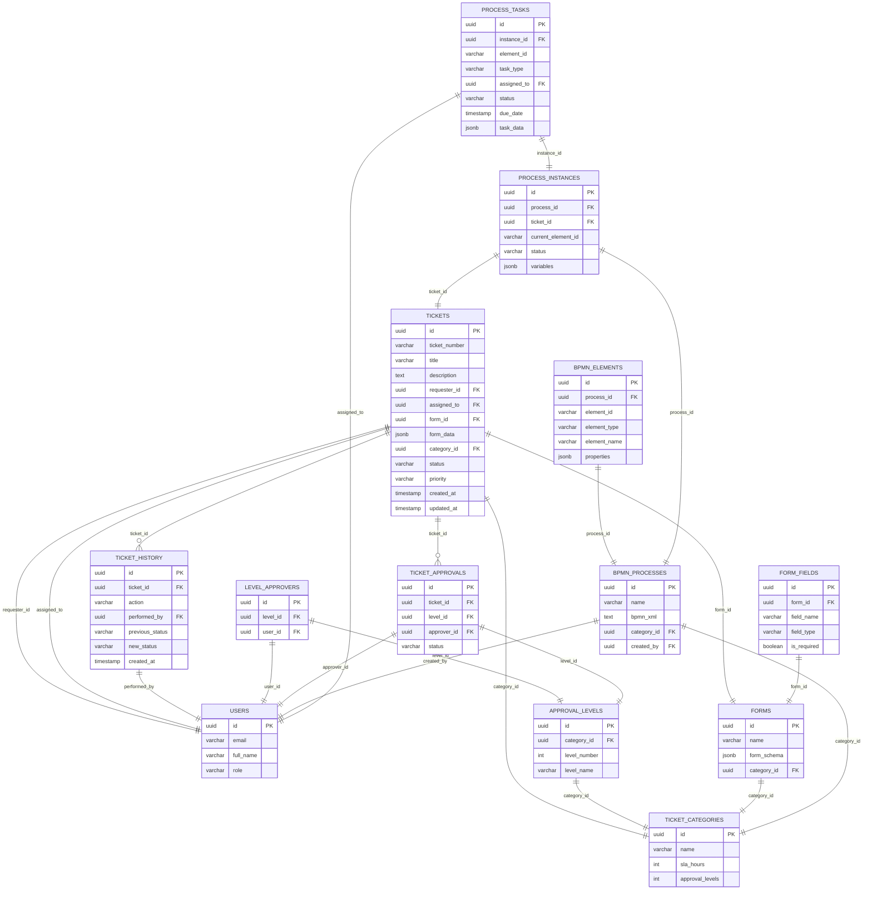

# Dicionário de Dados

## Lista de tabelas

```bash
List of relations
 Schema |       Name        | Type  | Owner
--------+-------------------+-------+-------
 public | ai_agent_logs     | table | admin
 public | approval_levels   | table | admin
 public | audit_log         | table | admin
 public | bpmn_elements     | table | admin
 public | bpmn_processes    | table | admin
 public | form_fields       | table | admin
 public | forms             | table | admin
 public | level_approvers   | table | admin
 public | process_instances | table | admin
 public | process_tasks     | table | admin
 public | ticket_approvals  | table | admin
 public | ticket_categories | table | admin
 public | ticket_history    | table | admin
 public | tickets           | table | admin
 public | users             | table | admin

```



### **Legenda e Observações**

*   `||--||` → relação **1:1**
    
*   `||--o{` → relação **1:N**
    
*   `jsonb` → campos flexíveis (ex: `form_data`, `task_data`)
    
*   Este diagrama mostra a **integração entre tickets, formulários, aprovações e processos BPM**.
    
*   Tickets possuem histórico (`ticket_history`) e aprovações (`ticket_approvals`) que podem ser escalonadas por níveis (`approval_levels`).
    
*   BPM está modelado com processos, elementos, instâncias e tarefas (`process_instances` e `process_tasks`) ligadas aos tickets.
  
* * *
📚 Dicionário de Dados – Sistema de Tickets e BPM
=================================================

1️⃣ Tabelas de Usuários e Autenticação
--------------------------------------

### **users**

*   **Função:** Armazena os usuários do sistema, suas credenciais e informações de perfil.
    
*   **Principais campos:**
    *   `id` (uuid): Identificador único do usuário.
        
    *   `email`, `password_hash`, `full_name`: Dados de login e nome completo.
        
    *   `role` e `department`: Função e departamento do usuário.
        
    *   `is_active`: Indica se o usuário está ativo.
        
    *   `created_at` / `updated_at`: Controle de auditoria.
        

* * *

2️⃣ Tabelas de Tickets
----------------------

### **ticket_categories**

*   **Função:** Define categorias de tickets (ex: incidente, pedido de férias, requisição de hardware).
    
*   **Campos importantes:**
    *   `name`, `description`, `sla_hours`, `approval_levels`.
        
*   **Relacionamentos:** Associada a `approval_levels`, `forms` e `tickets`.
    

### **tickets**

*   **Função:** Registra cada ticket aberto no sistema.
    
*   **Campos importantes:**
    *   `ticket_number`, `title`, `description`, `status`, `priority`.
        
    *   `requester_id`, `assigned_to` (FK → `users`)
        
    *   `form_id` (FK → `forms`) e `form_data` (JSON)
        
    *   `process_id` / `process_instance_id` (FK → BPM)
        
    *   `sla_due_date`, `created_at`, `updated_at`, `closed_at`
        
*   **Relacionamentos:**
    *   Histórico: `ticket_history`
        
    *   Aprovações: `ticket_approvals`
        
    *   Processos BPM: `process_instances`
        

### **ticket_history**

*   **Função:** Mantém o histórico de ações sobre cada ticket.
    
*   **Campos importantes:** `action`, `performed_by`, `previous_status`, `new_status`, `comments`, `metadata`, `created_at`.
    

### **ticket_approvals**

*   **Função:** Registra aprovações pendentes ou realizadas para tickets.
    
*   **Relacionamentos:** Liga `tickets` a `approval_levels` e `users`.
    

* * *

3️⃣ Tabelas de Formulários
--------------------------

### **forms**

*   **Função:** Armazena formulários que podem ser associados a tickets.
    
*   **Campos importantes:**
    *   `name`, `description`, `form_schema` (JSON), `version`, `is_active`, `category_id`, `created_by`
        
*   **Relacionamentos:** Ligação com `form_fields` e `tickets`.
    

### **form_fields**

*   **Função:** Define os campos que compõem cada formulário.
    
*   **Campos importantes:** `field_name`, `field_type`, `field_label`, `is_required`, `validation_rules` (JSON), `field_order`, `properties`.
    
*   **Relacionamentos:** FK → `forms`.
    

* * *

4️⃣ Tabelas de Aprovação
------------------------

### **approval_levels**

*   **Função:** Define níveis de aprovação para cada categoria de ticket.
    
*   **Campos importantes:** `level_number`, `level_name`, `required_role`, `auto_approve_conditions`, `timeout_hours`, `is_active`.
    
*   **Relacionamentos:** FK → `ticket_categories`, Referenciado por `level_approvers` e `ticket_approvals`.
    

### **level_approvers**

*   **Função:** Lista os usuários aprovadores para cada nível.
    
*   **Campos:** `level_id`, `user_id`, `is_backup`, `is_active`.
    

* * *

5️⃣ Tabelas de BPM (Processos)
------------------------------

### **bpmn_processes**

*   **Função:** Define processos BPM associados a tickets ou categorias.
    
*   **Campos:** `name`, `description`, `bpmn_xml`, `version`, `is_active`, `category_id`, `created_by`, `created_at`, `updated_at`.
    
*   **Relacionamentos:** FK → `ticket_categories` e `users`.
    

### **bpmn_elements**

*   **Função:** Elementos dentro de um processo BPM.
    
*   **Campos:** `element_id`, `element_type`, `element_name`, `properties`, `position_x`, `position_y`.
    
*   **Relacionamentos:** FK → `bpmn_processes`.
    

### **process_instances**

*   **Função:** Instâncias executadas de processos BPM para tickets.
    
*   **Campos:** `ticket_id`, `process_id`, `current_element_id`, `status`, `variables`, `started_at`, `completed_at`.
    
*   **Relacionamentos:** FK → `tickets` e `bpmn_processes`.
    

### **process_tasks**

*   **Função:** Tarefas geradas em processos BPM para execução por usuários.
    
*   **Campos:** `instance_id`, `element_id`, `task_type`, `assigned_to`, `status`, `due_date`, `task_data`.
    
*   **Relacionamentos:** FK → `process_instances` e `users`.
    

* * *

6️⃣ Logs e Auditoria
--------------------

### **audit_log**

*   **Função:** Registra mudanças em qualquer tabela do sistema.
    
*   **Campos:** `table_name`, `record_id`, `action`, `old_values`, `new_values`, `changed_by`, `changed_at`.
    
*   **Relacionamentos:** FK → `users`.
    

### **ai_agent_logs**

*   **Função:** Logs gerados por agentes de IA no sistema.
    
*   **Campos:** `user_id`, detalhes de execução, timestamps.
    
*   **Relacionamentos:** FK → `users`.
    

* * *

✅ Observações
-------------

*   Todas as tabelas de tickets, formulários e processos estão preparadas para integração futura com BPM, mantendo rastreabilidade (`ticket_history`), aprovações (`ticket_approvals`) e instâncias de processos (`process_instances`).
    
*   `jsonb` é amplamente utilizado em `form_schema`, `form_data`, `variables` e `task_data` para flexibilidade de campos dinâmicos.
    
*   Há índices em campos críticos como `status`, `assigned_to` e `ticket_number` para otimização de buscas.

* * *

 ```bash
                               Table "public.approval_levels"
         Column          |          Type          | Collation | Nullable |      Default
-------------------------+------------------------+-----------+----------+-------------------
 id                      | uuid                   |           | not null | gen_random_uuid()
 category_id             | uuid                   |           |          |
 level_number            | integer                |           | not null |
 level_name              | character varying(100) |           | not null |
 required_role           | character varying(50)  |           |          |
 auto_approve_conditions | jsonb                  |           |          |
 timeout_hours           | integer                |           |          | 48
 is_active               | boolean                |           |          | true
Indexes:
    "approval_levels_pkey" PRIMARY KEY, btree (id)
Foreign-key constraints:
    "approval_levels_category_id_fkey" FOREIGN KEY (category_id) REFERENCES ticket_categories(id)
Referenced by:
    TABLE "level_approvers" CONSTRAINT "level_approvers_level_id_fkey" FOREIGN KEY (level_id) REFERENCES approval_levels(id) ON DELETE CASCADE
    TABLE "ticket_approvals" CONSTRAINT "ticket_approvals_level_id_fkey" FOREIGN KEY (level_id) REFERENCES approval_levels(id)
	
```

```bash

                             Table "public.audit_log"
   Column   |            Type             | Collation | Nullable |      Default
------------+-----------------------------+-----------+----------+-------------------
 id         | uuid                        |           | not null | gen_random_uuid()
 table_name | character varying(100)      |           | not null |
 record_id  | uuid                        |           | not null |
 action     | character varying(20)       |           | not null |
 old_values | jsonb                       |           |          |
 new_values | jsonb                       |           |          |
 changed_by | uuid                        |           |          |
 changed_at | timestamp without time zone |           |          | CURRENT_TIMESTAMP
Indexes:
    "audit_log_pkey" PRIMARY KEY, btree (id)
Foreign-key constraints:
    "audit_log_changed_by_fkey" FOREIGN KEY (changed_by) REFERENCES users(id)
	
 ```

```bash
                           Table "public.bpmn_elements"
    Column    |          Type          | Collation | Nullable |      Default
--------------+------------------------+-----------+----------+-------------------
 id           | uuid                   |           | not null | gen_random_uuid()
 process_id   | uuid                   |           |          |
 element_id   | character varying(100) |           | not null |
 element_type | character varying(50)  |           | not null |
 element_name | character varying(255) |           |          |
 properties   | jsonb                  |           |          |
 position_x   | integer                |           |          |
 position_y   | integer                |           |          |
Indexes:
    "bpmn_elements_pkey" PRIMARY KEY, btree (id)
Foreign-key constraints:
    "bpmn_elements_process_id_fkey" FOREIGN KEY (process_id) REFERENCES bpmn_processes(id) ON DELETE CASCADE

```

```bash
                            Table "public.bpmn_processes"
   Column    |            Type             | Collation | Nullable |      Default
-------------+-----------------------------+-----------+----------+-------------------
 id          | uuid                        |           | not null | gen_random_uuid()
 name        | character varying(255)      |           | not null |
 description | text                        |           |          |
 bpmn_xml    | text                        |           | not null |
 version     | integer                     |           |          | 1
 is_active   | boolean                     |           |          | true
 category_id | uuid                        |           |          |
 created_by  | uuid                        |           |          |
 created_at  | timestamp without time zone |           |          | CURRENT_TIMESTAMP
 updated_at  | timestamp without time zone |           |          | CURRENT_TIMESTAMP
Indexes:
    "bpmn_processes_pkey" PRIMARY KEY, btree (id)
Foreign-key constraints:
    "bpmn_processes_category_id_fkey" FOREIGN KEY (category_id) REFERENCES ticket_categories(id)
    "bpmn_processes_created_by_fkey" FOREIGN KEY (created_by) REFERENCES users(id)
Referenced by:
    TABLE "bpmn_elements" CONSTRAINT "bpmn_elements_process_id_fkey" FOREIGN KEY (process_id) REFERENCES bpmn_processes(id) ON DELETE CASCADE
    TABLE "process_instances" CONSTRAINT "process_instances_process_id_fkey" FOREIGN KEY (process_id) REFERENCES bpmn_processes(id)
    TABLE "tickets" CONSTRAINT "tickets_process_id_fkey" FOREIGN KEY (process_id) REFERENCES bpmn_processes(id)	
 
 ```

```bash
                              Table "public.form_fields"
      Column      |          Type          | Collation | Nullable |      Default
------------------+------------------------+-----------+----------+-------------------
 id               | uuid                   |           | not null | gen_random_uuid()
 form_id          | uuid                   |           |          |
 field_name       | character varying(100) |           | not null |
 field_type       | character varying(50)  |           | not null |
 field_label      | character varying(255) |           |          |
 is_required      | boolean                |           |          | false
 validation_rules | jsonb                  |           |          |
 field_order      | integer                |           |          |
 properties       | jsonb                  |           |          |
Indexes:
    "form_fields_pkey" PRIMARY KEY, btree (id)
Foreign-key constraints:
    "form_fields_form_id_fkey" FOREIGN KEY (form_id) REFERENCES forms(id) ON DELETE CASCADE
 
```

```bash
                                 Table "public.forms"
   Column    |            Type             | Collation | Nullable |      Default
-------------+-----------------------------+-----------+----------+-------------------
 id          | uuid                        |           | not null | gen_random_uuid()
 name        | character varying(255)      |           | not null |
 description | text                        |           |          |
 form_schema | jsonb                       |           | not null |
 version     | integer                     |           |          | 1
 is_active   | boolean                     |           |          | true
 category_id | uuid                        |           |          |
 created_by  | uuid                        |           |          |
 created_at  | timestamp without time zone |           |          | CURRENT_TIMESTAMP
 updated_at  | timestamp without time zone |           |          | CURRENT_TIMESTAMP
Indexes:
    "forms_pkey" PRIMARY KEY, btree (id)
Foreign-key constraints:
    "forms_category_id_fkey" FOREIGN KEY (category_id) REFERENCES ticket_categories(id)
    "forms_created_by_fkey" FOREIGN KEY (created_by) REFERENCES users(id)
Referenced by:
    TABLE "form_fields" CONSTRAINT "form_fields_form_id_fkey" FOREIGN KEY (form_id) REFERENCES forms(id) ON DELETE CASCADE
    TABLE "tickets" CONSTRAINT "tickets_form_id_fkey" FOREIGN KEY (form_id) REFERENCES forms(id)
	
 ```

```bash
                 Table "public.level_approvers"
  Column   |  Type   | Collation | Nullable |      Default
-----------+---------+-----------+----------+-------------------
 id        | uuid    |           | not null | gen_random_uuid()
 level_id  | uuid    |           |          |
 user_id   | uuid    |           |          |
 is_backup | boolean |           |          | false
 is_active | boolean |           |          | true
Indexes:
    "level_approvers_pkey" PRIMARY KEY, btree (id)
Foreign-key constraints:
    "level_approvers_level_id_fkey" FOREIGN KEY (level_id) REFERENCES approval_levels(id) ON DELETE CASCADE
    "level_approvers_user_id_fkey" FOREIGN KEY (user_id) REFERENCES users(id)
	
  ```

```bash
                                    Table "public.process_instances"
       Column       |            Type             | Collation | Nullable |           Default
--------------------+-----------------------------+-----------+----------+------------------------------
 id                 | uuid                        |           | not null | gen_random_uuid()
 process_id         | uuid                        |           |          |
 ticket_id          | uuid                        |           |          |
 current_element_id | character varying(100)      |           |          |
 status             | character varying(50)       |           |          | 'running'::character varying
 variables          | jsonb                       |           |          |
 started_at         | timestamp without time zone |           |          | CURRENT_TIMESTAMP
 completed_at       | timestamp without time zone |           |          |
Indexes:
    "process_instances_pkey" PRIMARY KEY, btree (id)
    "idx_process_instances_status" btree (status)
Foreign-key constraints:
    "process_instances_process_id_fkey" FOREIGN KEY (process_id) REFERENCES bpmn_processes(id)
    "process_instances_ticket_id_fkey" FOREIGN KEY (ticket_id) REFERENCES tickets(id)
Referenced by:
    TABLE "process_tasks" CONSTRAINT "process_tasks_instance_id_fkey" FOREIGN KEY (instance_id) REFERENCES process_instances(id) ON DELETE CASCADE
	
```

```bash
                                  Table "public.process_tasks"
    Column    |            Type             | Collation | Nullable |           Default
--------------+-----------------------------+-----------+----------+-----------------------------
 id           | uuid                        |           | not null | gen_random_uuid()
 instance_id  | uuid                        |           |          |
 element_id   | character varying(100)      |           | not null |
 task_type    | character varying(50)       |           | not null |
 assigned_to  | uuid                        |           |          |
 status       | character varying(20)       |           |          | 'active'::character varying
 due_date     | timestamp without time zone |           |          |
 task_data    | jsonb                       |           |          |
 started_at   | timestamp without time zone |           |          | CURRENT_TIMESTAMP
 completed_at | timestamp without time zone |           |          |
Indexes:
    "process_tasks_pkey" PRIMARY KEY, btree (id)
    "idx_process_tasks_assigned" btree (assigned_to)
    "idx_process_tasks_status" btree (status)
Foreign-key constraints:
    "process_tasks_assigned_to_fkey" FOREIGN KEY (assigned_to) REFERENCES users(id)
    "process_tasks_instance_id_fkey" FOREIGN KEY (instance_id) REFERENCES process_instances(id) ON DELETE CASCADE
	
```

```bash
                             Table "public.ticket_categories"
     Column      |            Type             | Collation | Nullable |      Default
-----------------+-----------------------------+-----------+----------+-------------------
 id              | uuid                        |           | not null | gen_random_uuid()
 name            | character varying(100)      |           | not null |
 description     | text                        |           |          |
 sla_hours       | integer                     |           |          | 24
 approval_levels | integer                     |           |          | 1
 is_active       | boolean                     |           |          | true
 created_at      | timestamp without time zone |           |          | CURRENT_TIMESTAMP
Indexes:
    "ticket_categories_pkey" PRIMARY KEY, btree (id)
Referenced by:
    TABLE "approval_levels" CONSTRAINT "approval_levels_category_id_fkey" FOREIGN KEY (category_id) REFERENCES ticket_categories(id)
    TABLE "bpmn_processes" CONSTRAINT "bpmn_processes_category_id_fkey" FOREIGN KEY (category_id) REFERENCES ticket_categories(id)
    TABLE "forms" CONSTRAINT "forms_category_id_fkey" FOREIGN KEY (category_id) REFERENCES ticket_categories(id)
    TABLE "tickets" CONSTRAINT "tickets_category_id_fkey" FOREIGN KEY (category_id) REFERENCES ticket_categories(id)
 
  ```

```bash
                              Table "public.ticket_history"
     Column      |            Type             | Collation | Nullable |      Default
-----------------+-----------------------------+-----------+----------+-------------------
 id              | uuid                        |           | not null | gen_random_uuid()
 ticket_id       | uuid                        |           |          |
 action          | character varying(100)      |           | not null |
 performed_by    | uuid                        |           |          |
 previous_status | character varying(50)       |           |          |
 new_status      | character varying(50)       |           |          |
 comments        | text                        |           |          |
 metadata        | jsonb                       |           |          |
 created_at      | timestamp without time zone |           |          | CURRENT_TIMESTAMP
Indexes:
    "ticket_history_pkey" PRIMARY KEY, btree (id)
    "idx_ticket_history_ticket" btree (ticket_id)
Foreign-key constraints:
    "ticket_history_performed_by_fkey" FOREIGN KEY (performed_by) REFERENCES users(id)
    "ticket_history_ticket_id_fkey" FOREIGN KEY (ticket_id) REFERENCES tickets(id) ON DELETE CASCADE
	
 ```

```bash
                                         Table "public.tickets"
       Column        |            Type             | Collation | Nullable |           Default
---------------------+-----------------------------+-----------+----------+-----------------------------
 id                  | uuid                        |           | not null | gen_random_uuid()
 ticket_number       | character varying(20)       |           | not null |
 title               | character varying(255)      |           | not null |
 description         | text                        |           |          |
 category_id         | uuid                        |           |          |
 priority            | character varying(20)       |           |          | 'medium'::character varying
 status              | character varying(50)       |           |          | 'open'::character varying
 requester_id        | uuid                        |           |          |
 assigned_to         | uuid                        |           |          |
 form_id             | uuid                        |           |          |
 form_data           | jsonb                       |           |          |
 process_id          | uuid                        |           |          |
 process_instance_id | uuid                        |           |          |
 sla_due_date        | timestamp without time zone |           |          |
 created_at          | timestamp without time zone |           |          | CURRENT_TIMESTAMP
 updated_at          | timestamp without time zone |           |          | CURRENT_TIMESTAMP
 closed_at           | timestamp without time zone |           |          |
Indexes:
    "tickets_pkey" PRIMARY KEY, btree (id)
    "idx_tickets_category" btree (category_id)
    "idx_tickets_created_at" btree (created_at)
    "idx_tickets_requester" btree (requester_id)
    "idx_tickets_sla_due" btree (sla_due_date)
    "idx_tickets_status" btree (status)
    "tickets_ticket_number_key" UNIQUE CONSTRAINT, btree (ticket_number)
Foreign-key constraints:
    "tickets_assigned_to_fkey" FOREIGN KEY (assigned_to) REFERENCES users(id)
    "tickets_category_id_fkey" FOREIGN KEY (category_id) REFERENCES ticket_categories(id)
    "tickets_form_id_fkey" FOREIGN KEY (form_id) REFERENCES forms(id)
    "tickets_process_id_fkey" FOREIGN KEY (process_id) REFERENCES bpmn_processes(id)
    "tickets_requester_id_fkey" FOREIGN KEY (requester_id) REFERENCES users(id)
Referenced by:
    TABLE "process_instances" CONSTRAINT "process_instances_ticket_id_fkey" FOREIGN KEY (ticket_id) REFERENCES tickets(id)
    TABLE "ticket_approvals" CONSTRAINT "ticket_approvals_ticket_id_fkey" FOREIGN KEY (ticket_id) REFERENCES tickets(id) ON DELETE CASCADE
    TABLE "ticket_history" CONSTRAINT "ticket_history_ticket_id_fkey" FOREIGN KEY (ticket_id) REFERENCES tickets(id) ON DELETE CASCADE
Triggers:
    trigger_set_ticket_number BEFORE INSERT ON tickets FOR EACH ROW EXECUTE FUNCTION set_ticket_number()
	
```

```bash
                                      Table "public.users"
    Column     |            Type             | Collation | Nullable |          Default
---------------+-----------------------------+-----------+----------+---------------------------
 id            | uuid                        |           | not null | gen_random_uuid()
 email         | character varying(255)      |           | not null |
 password_hash | character varying(255)      |           | not null |
 full_name     | character varying(255)      |           | not null |
 role          | character varying(50)       |           | not null | 'user'::character varying
 department    | character varying(100)      |           |          |
 is_active     | boolean                     |           |          | true
 created_at    | timestamp without time zone |           |          | CURRENT_TIMESTAMP
 updated_at    | timestamp without time zone |           |          | CURRENT_TIMESTAMP
Indexes:
    "users_pkey" PRIMARY KEY, btree (id)
    "users_email_key" UNIQUE CONSTRAINT, btree (email)
Referenced by:
    TABLE "ai_agent_logs" CONSTRAINT "ai_agent_logs_user_id_fkey" FOREIGN KEY (user_id) REFERENCES users(id)
    TABLE "audit_log" CONSTRAINT "audit_log_changed_by_fkey" FOREIGN KEY (changed_by) REFERENCES users(id)
    TABLE "bpmn_processes" CONSTRAINT "bpmn_processes_created_by_fkey" FOREIGN KEY (created_by) REFERENCES users(id)
    TABLE "forms" CONSTRAINT "forms_created_by_fkey" FOREIGN KEY (created_by) REFERENCES users(id)
    TABLE "level_approvers" CONSTRAINT "level_approvers_user_id_fkey" FOREIGN KEY (user_id) REFERENCES users(id)
    TABLE "process_tasks" CONSTRAINT "process_tasks_assigned_to_fkey" FOREIGN KEY (assigned_to) REFERENCES users(id)
    TABLE "ticket_approvals" CONSTRAINT "ticket_approvals_approver_id_fkey" FOREIGN KEY (approver_id) REFERENCES users(id)
    TABLE "ticket_history" CONSTRAINT "ticket_history_performed_by_fkey" FOREIGN KEY (performed_by) REFERENCES users(id)
    TABLE "tickets" CONSTRAINT "tickets_assigned_to_fkey" FOREIGN KEY (assigned_to) REFERENCES users(id)
    TABLE "tickets" CONSTRAINT "tickets_requester_id_fkey" FOREIGN KEY (requester_id) REFERENCES users(id)       
```


